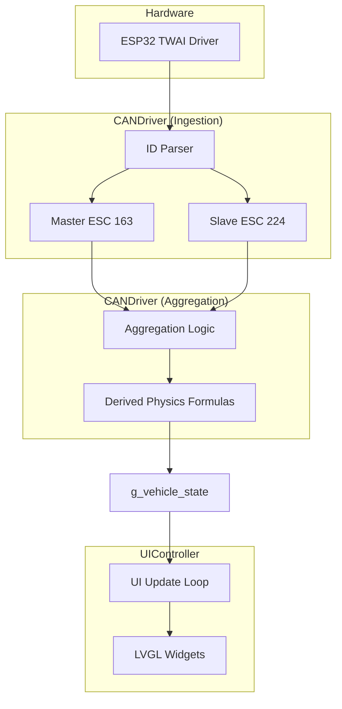

# System Architecture: Telemetry Pipeline

This document defines the official data flow for the ACCELER8 DashBoard, from raw CAN hardware to the LVGL display.

## 1. Hardware Layer (CAN Bus)
*   **Driver**: ESP32-S3 TWAI (Two-Wire Automotive Interface).
*   **Pins**: TX: 6, RX: 0.
*   **Speed**: 1.0 Mbps (Fixed for Flipsky FT85BD).
*   **Protocol**: Flipsky FTESC CAN Protocol V1.4 (Extended 29-bit IDs).

## 2. Driver Layer (`can_driver.cpp`)
The `CANDriver` module is responsible for ingestion and processing of raw frames.

### Frame Ingestion
Messages are filtered and parsed using the Flipsky ID layout:
*   **MCU ID Parsing**: `(raw_id >> 8) & 0xFF`.
*   **Command ID Parsing**: `raw_id & 0xFF`.

### Aggregation & Multi-ESC Support
The system tracks two ESCs simultaneously:
1.  **Master ESC** (ID: 163)
2.  **Slave ESC** (ID: 224)

Telemetry from both ESCs is stored in internal `EscData` structs and then aggregated into the global `g_vehicle_state`:
*   **Voltage**: Average of both ESC voltages.
*   **Current (Battery)**: Sum of Master + Slave battery currents (for total Wattage).
*   **Current (Motor)**: Sum of Master + Slave motor phase currents.
*   **Temperatures**: Maximum (peak) temp across all FETs/Motors is reported for safety.
*   **ERPM**: Default to Master ERPM (Slave used as fallback).

## 3. Global State (`VehicleState`)
`g_vehicle_state` acts as the single source of truth for the entire application. It contains both raw aggregated values and derived metrics (Wh, Range, Max Speed).

## 4. Presentation Layer (`ui_controller.cpp`)
The `UIController` runs every LVGL tick:
1.  Reads from `g_vehicle_state`.
2.  Applies UI-specific scaling (e.g., KM/H calculation, standardizing `buf` strings).
3.  Updates LVGL widgets (labels, bars, strips).
4.  Applies conditional styling (e.g., changing colors to `color_accent` if temps exceed thresholds).

---

## Data Flow Diagram

