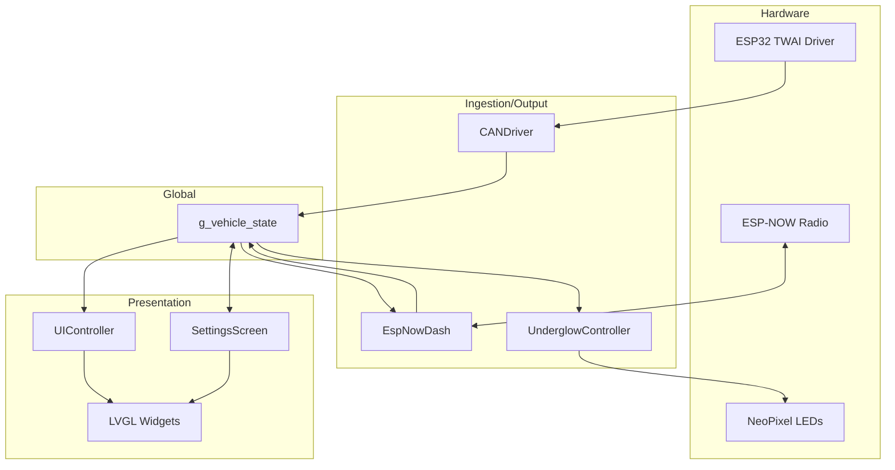

# System Architecture: Telemetry Pipeline

This document defines the official data flow for the ACCELER8 DashBoard, from raw inputs (CAN, ESP-NOW) to outputs (LVGL display, LEDs, ESP-NOW telemetry).

## 1. Hardware Layer
*   **CAN Bus**: ESP32-S3 TWAI (Two-Wire Automotive Interface). TX: 6, RX: 0 at 1.0 Mbps.
*   **Wireless**: ESP32 Wi-Fi Radio using ESP-NOW.
*   **Touch IC**: GT911 on I2C (SDA=15, SCL=7) for display interactions.
*   **Underglow LEDs**: WS2815/WS2813 strip on GPIO 4 using `NeoPixelBus` via I2S/SPI.

## 2. Ingestion & Driver Layer
### `can_driver.cpp`
The `CANDriver` module is responsible for ingestion and processing of raw frames from a Flipsky FT85BD ESC.
*   **Aggregation**: Tracks two ESCs (Master ID: 163, Slave ID: 224) simultaneously.
*   Voltage is averaged, currents are summed, and peak temperatures are kept for safety.

### `espnow_dash.cpp`
Handles wireless communication:
*   **TX (Output)**: Broadcasts `TelemetryPacket` at 10Hz to a paired remote for external consumption.
*   **RX (Input)**: Receives `ReceiverStatusPacket` (e.g. remote disconnected) and `ControlPacket` (button presses) from the receiver. It can also receive mock `TelemetryPacket`s to test the UI without physical CAN hardware.

## 3. Global State (`VehicleState`)
`g_vehicle_state` acts as the single source of truth for the entire application. It contains raw aggregated values, derived metrics (Wh, Range, Speed), hardware status (CAN alive, remote disconnected), input state (`remote_button_state`), and LED configuration (color, mode, brightness).

## 4. Application & Presentation Layer
### `ui_controller.cpp`
The main display manager, running every LVGL tick:
1.  Reads from `g_vehicle_state`.
2.  Updates main dashboard UI widgets (Speed, Power, Trip, Battery Strip).
3.  Handles full-screen alerts (CAN Timeout, Overtemp, Remote Disconnect).

### `settings_screen.cpp`
An interactive LVGL screen accessible via remote button input.
*   Allows live modification of mechanical configuration (Pole Pairs, Gear Ratio, Wheel Diameter) and Odometer reset.
*   Saves configurations to non-volatile storage.

### `underglow_controller.cpp`
Manages the visual LED effects based on telemetry and settings:
*   Reads speed and user preferences from `g_vehicle_state`.
*   Applies modes such as Solid, Breathing (Purple to Cyan), or Speed Reactive (shifting colors based on `speed_kmh`).

---

## Data Flow Diagram

